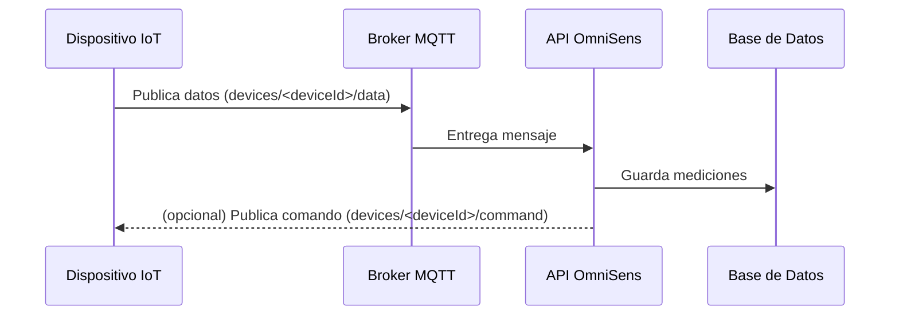
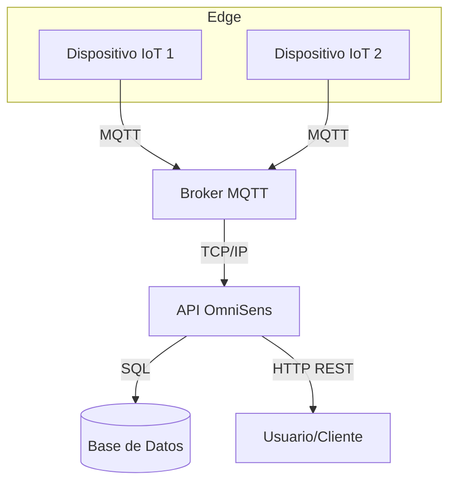

# OmniSens API

API RESTful para la gestión de dispositivos IoT, almacenamiento de datos de sensores y envío de comandos vía MQTT.

---

## Tabla de Contenidos
- [Introducción](#introducción)
- [Instalación y Configuración](#instalación-y-configuración)
- [Autenticación](#autenticación)
- [Rutas de la API](#rutas-de-la-api)
- [Ejemplos de Uso](#ejemplos-de-uso)
- [Modelo de Base de Datos](#modelo-de-base-de-datos)
- [Integración MQTT](#integración-mqtt)
- [Diagramas](#diagramas)
- [Preguntas Frecuentes (FAQ)](#preguntas-frecuentes-faq)
- [Glosario](#glosario)
- [Guía Rápida de Despliegue](#guía-rápida-de-despliegue)

---

## Introducción
OmniSens API permite interactuar con dispositivos IoT, consultar datos históricos de sensores y enviar comandos a través de MQTT. Es ideal para proyectos de monitoreo ambiental, automatización y prototipos educativos.

**URL Base:** `http://localhost:3000/api`

---

## Instalación y Configuración

1. Clona el repositorio y entra en la carpeta `api`:
   ```sh
   git clone <repo_url>
   cd C-Prototipos/OmniSens/api
   ```
2. Instala las dependencias:
   ```sh
   npm install
   ```
3. Copia el archivo `.env` de ejemplo y configura tus variables:
   ```sh
   cp .env.example .env
   # Edita .env con tus credenciales y configuración
   ```
4. Inicia el servidor:
   ```sh
   npm start
   # o en modo desarrollo
   npm run dev
   ```

---

## Autenticación

Todas las rutas requieren una API Key enviada en la cabecera HTTP `x-api-key`.

- **Cabecera requerida:**
  ```
  x-api-key: <tu_clave_secreta_aqui>
  ```
- Si la clave es incorrecta o falta, la API responde con `401 Unauthorized`.

---

## Rutas de la API

| Método | Endpoint                          | Descripción                                 |
|--------|------------------------------------|---------------------------------------------|
| GET    | `/devices`                        | Lista todos los dispositivos registrados    |
| GET    | `/devices/:deviceId/data`         | Últimas mediciones de un dispositivo        |
| POST   | `/devices/:deviceId/command`      | Envía un comando a un dispositivo           |

---

## Ejemplos de Uso

### 1. Listar todos los dispositivos
```http
GET /api/devices
x-api-key: <tu_clave>
```
**Respuesta:**
```json
{
  "devices": [
    {
      "device_eui": "dispositivo_lora_001",
      "name": "Dispositivo dispositivo_lora_001",
      "location": null,
      "created_at": "2025-06-07T10:30:00.000Z"
    },
    {
      "device_eui": "esp32_sensor_A",
      "name": "Dispositivo esp32_sensor_A",
      "location": "Laboratorio 1",
      "created_at": "2025-06-07T11:15:00.000Z"
    }
  ]
}
```

### 2. Obtener datos de un dispositivo
```http
GET /api/devices/esp32_sensor_A/data?limit=5
x-api-key: <tu_clave>
```
**Respuesta:**
```json
{
  "data": [
    {
      "value": 25.5,
      "timestamp": "2025-06-07T12:05:10.000Z",
      "sensor_type": "temperature",
      "unit": "°C"
    },
    {
      "value": 45.2,
      "timestamp": "2025-06-07T12:05:10.000Z",
      "sensor_type": "humidity",
      "unit": "%"
    },
    {
      "value": 25.1,
      "timestamp": "2025-06-07T12:04:55.000Z",
      "sensor_type": "temperature",
      "unit": "°C"
    }
  ]
}
```

### 3. Enviar un comando a un dispositivo
```http
POST /api/devices/esp32_sensor_A/command
x-api-key: <tu_clave>
Content-Type: application/json

{
  "actuator": "led_rojo",
  "value": 1
}
```
**Respuesta:**
```json
{
  "success": true,
  "message": "Comando enviado al dispositivo esp32_sensor_A."
}
```

---

## Modelo de Base de Datos

La base de datos utiliza MariaDB/MySQL. Las tablas principales son:

- **devices**: Información de cada dispositivo (EUI, nombre, ubicación, fecha de alta).
- **sensor_types**: Tipos de sensores (ej: temperatura, humedad).
- **measurements**: Registra cada medición recibida, asociada a un dispositivo y tipo de sensor.

**Relaciones:**
- Un dispositivo puede tener múltiples mediciones.
- Cada medición está asociada a un tipo de sensor.

**Ejemplo de estructura simplificada:**
```sql
CREATE TABLE devices (
  id INT AUTO_INCREMENT PRIMARY KEY,
  device_eui VARCHAR(64) UNIQUE NOT NULL,
  name VARCHAR(128),
  location VARCHAR(128),
  created_at DATETIME DEFAULT CURRENT_TIMESTAMP
);

CREATE TABLE sensor_types (
  id INT AUTO_INCREMENT PRIMARY KEY,
  name VARCHAR(64) UNIQUE NOT NULL,
  unit VARCHAR(16)
);

CREATE TABLE measurements (
  id INT AUTO_INCREMENT PRIMARY KEY,
  device_id INT,
  sensor_type_id INT,
  value FLOAT,
  timestamp DATETIME,
  FOREIGN KEY (device_id) REFERENCES devices(id),
  FOREIGN KEY (sensor_type_id) REFERENCES sensor_types(id)
);
```

### Diagrama de relaciones (simplificado)

```
[devices] 1---* [measurements] *---1 [sensor_types]
```

- Un dispositivo puede tener muchas mediciones.
- Cada medición corresponde a un tipo de sensor.

### Ejemplo de registro en la tabla `measurements`

| id | device_id | sensor_type_id | value | timestamp           |
|----|-----------|---------------|-------|---------------------|
| 1  | 2         | 1             | 25.5  | 2025-06-07 12:05:10 |
| 2  | 2         | 2             | 45.2  | 2025-06-07 12:05:10 |

---

## Integración MQTT

La API se conecta a un broker MQTT para recibir datos y enviar comandos.

### Flujo de datos

1. **Dispositivo** publica datos en el tópico MQTT: `devices/<deviceId>/data`.
2. **API** recibe el mensaje, lo valida y almacena cada campo como una medición en la base de datos.
3. **Comandos**: La API publica en `devices/<deviceId>/command` para que el dispositivo ejecute una acción.

### Ejemplo de mensaje recibido (payload MQTT):
```json
{
  "temperature": 25.5,
  "humidity": 45.2,
  "co2": 800
}
```

- El tópico típico es: `devices/<deviceId>/data`
- El backend extrae el `deviceId` del tópico y almacena cada campo como una medición.

### Ejemplo de comando publicado (payload MQTT):
```json
{
  "actuator": "led_rojo",
  "value": 1
}
```
- El tópico de comando es: `devices/<deviceId>/command`

### Ejemplo de suscripción y publicación con mosquitto

Suscribirse a los datos de un dispositivo:
```sh
mosquitto_sub -h <broker_host> -t "devices/esp32_sensor_A/data" -u <usuario> -P <password>
```

Publicar un comando manualmente:
```sh
mosquitto_pub -h <broker_host> -t "devices/esp32_sensor_A/command" -u <usuario> -P <password> -m '{"actuator":"led_rojo","value":1}'
```

---

## Diagramas

### Arquitectura General


### Flujo de Datos (Secuencia Simplificada)



### Modelo Entidad-Relación (ER)


#### Diagrama de despliegue (simplificado)



---

## Estructura de Respuestas
- **200 OK:** Respuesta exitosa con datos solicitados.
- **400 Bad Request:** Faltan parámetros o cuerpo inválido.
- **401 Unauthorized:** API Key incorrecta o ausente.
- **404 Not Found:** No se encontraron datos para el recurso solicitado.

---

## Recomendaciones de Seguridad
- Cambia la clave `API_KEY` por una fuerte y única en tu archivo `.env`.
- No compartas tu archivo `.env` ni lo subas a repositorios públicos.
- Usa HTTPS en producción.

---

## Pruebas y Troubleshooting
- Usa herramientas como [Postman](https://www.postman.com/) o `curl` para probar los endpoints.
- Verifica que el broker MQTT esté accesible y que las credenciales sean correctas.
- Revisa los logs del servidor para mensajes de error detallados.
- Si tienes problemas de conexión a la base de datos, revisa el archivo `.env` y la configuración de red.

### Ejemplo de prueba con curl

Listar dispositivos:
```sh
curl -H "x-api-key: <tu_clave>" http://localhost:3000/api/devices
```

Obtener datos de un dispositivo:
```sh
curl -H "x-api-key: <tu_clave>" http://localhost:3000/api/devices/esp32_sensor_A/data?limit=3
```

Enviar comando:
```sh
curl -X POST -H "x-api-key: <tu_clave>" -H "Content-Type: application/json" \
  -d '{"actuator":"led_rojo","value":1}' \
  http://localhost:3000/api/devices/esp32_sensor_A/command
```

---

## Preguntas Frecuentes (FAQ)

### ¿Qué hago si recibo un error 401?
Verifica que estés enviando la cabecera `x-api-key` con la clave correcta. Consulta el archivo `.env` para la clave configurada.

### ¿Cómo agrego un nuevo tipo de sensor?
Envía datos con una nueva clave (por ejemplo, `"luminosity": 123`) y la API lo registrará automáticamente en la tabla `sensor_types`.

### ¿Puedo usar la API desde Postman o Insomnia?
Sí, solo asegúrate de incluir la cabecera `x-api-key` en cada solicitud.

### ¿Cómo pruebo la conexión MQTT?
Utiliza herramientas como `mosquitto_pub` y `mosquitto_sub` para publicar y suscribirte a tópicos manualmente. Ejemplos incluidos arriba.

### ¿Dónde encuentro ejemplos de payloads?
En la sección [Integración MQTT](#integración-mqtt) y en los ejemplos de uso.

### ¿Qué hago si la API no conecta con la base de datos?
Verifica los datos de conexión en `.env`, que el servicio de base de datos esté activo y que el usuario tenga permisos.

### ¿Cómo puedo extender la API?
Consulta la documentación interna en `docs/` y sigue la estructura de controladores y servicios.

---

## Glosario

- **MQTT**: Protocolo ligero de mensajería para IoT.
- **EUI**: Identificador único extendido de dispositivo.
- **Payload**: Carga útil de datos enviada en un mensaje.
- **Broker**: Servidor que enruta mensajes MQTT entre clientes.
- **API Key**: Clave secreta para autenticar solicitudes a la API.
- **Edge**: Dispositivos en el borde de la red (sensores, actuadores).

---

## Guía Rápida de Despliegue

1. Clona el repositorio y configura el archivo `.env` con tus credenciales.
2. Asegúrate de tener una base de datos MariaDB/MySQL accesible y el broker MQTT funcionando.
3. Instala dependencias con `npm install`.
4. Ejecuta migraciones SQL si es necesario (`omnisens_schema.sql`).
5. Inicia la API con `npm start` o `npm run dev`.
6. Prueba la API con Postman, curl o desde tu frontend.

---

## Recursos y Créditos
- [Documentación MQTT](https://mqtt.org/documentation)
- [Documentación Express.js](https://expressjs.com/)
- [Documentación MySQL/MariaDB](https://mariadb.com/kb/en/documentation/)

### Documentación adicional
- [docs/arquitectura.md](../docs/arquitectura.md): Arquitectura general del sistema
- [docs/integracion.md](../docs/integracion.md): Integración de dispositivos y ejemplos avanzados
- [docs/Edge-Devices.md](../docs/Edge-Devices.md): Especificaciones de hardware y firmware

Desarrollado por el equipo de Programador FullStack IoT - ISPC 2024.

Para más detalles, consulta la documentación interna y los comentarios en el código fuente.