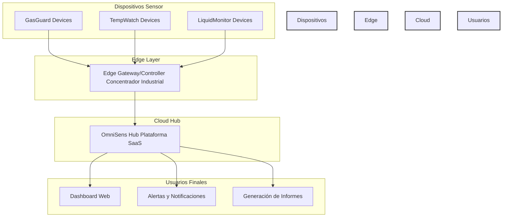

# OmniSens Industrial Suite

**OmniSens Industrial Suite** es una plataforma **IoT** modular, pensada para **monitoreo ambiental en entornos industriales**.   
Ofrece una solución completa que se adapta a diferentes necesidades de monitoreo, desde gases y temperatura hasta líquidos y otros parámetros críticos para la seguridad industrial y la eficiencia de procesos.

El objetivo es desarrollar la **plataforma SaaS (OmniSens Hub)** y crear familias de software y dispositivos **modulares y escalables** que se integren a este hub central. El sistema está diseñado para ser **adaptable** a cada caso de estudio y cliente.

---

## Índice

1.  [Descripción General](#descripción-general)
2.  [Productos Principales](#productos-principales)
3.  [Arquitectura General](#arquitectura-general)
4.  [Relación de Capas IoT con el Repositorio](#relación-de-capas-iot-con-el-repositorio)
5.  [Estructura del Repositorio](#estructura-del-repositorio)
6.  [Integración Industrial](#integración-industrial)
7.  [Documentación](#documentación)
8.  [Hoja de Ruta (Roadmap)](#hoja-de-ruta-roadmap)
9.  [Estado del Proyecto](#estado-del-proyecto)
10. [Licencia](#licencia)
11. [Instalación](#instalación)
12. [Desarrollo y Contribución](#desarrollo-y-contribución)
13. [Próximos Pasos](#próximos-pasos)

---

## Descripción General

OmniSens Industrial Suite es una familia de productos diseñada para monitorear variables ambientales en entornos industriales, con foco en seguridad, eficiencia y adaptabilidad.   
Combina tecnologías de **sensores IoT en planta**, **procesamiento local en gateways/edge** y **análisis en la nube (SaaS)**.

Ofrece funcionalidades sólidas como:
*   Visualización de datos en tiempo real.
*   Alertas y notificaciones personalizables (email, SMS, Telegram, etc.).
*   Informes y análisis de datos históricos.
*   Acceso remoto y seguro.
*   Gestión centralizada de dispositivos.

---

## Productos Principales

La suite OmniSens Industrial incluye:

*   **OmniSens Hub**: Plataforma **SaaS** central de integración, visualización, gestión y análisis de datos [1, 2, 7]. Es la "columna vertebral en la nube" del sistema.
*   **OmniSens GasGuard**: Línea de productos para el monitoreo de gases peligrosos en ambientes industriales. Incluye versiones Basic (gases básicos) y Advanced/Pro (gases específicos, detección múltiple).
*   **OmniSens TempWatch**: Línea de productos para el monitoreo de temperatura en procesos industriales, asegurando rangos seguros. Incluye versiones Basic (alertas email/SMS), Advanced (registro/análisis) y Pro (integración con sistemas de control).
*   **OmniSens LiquidMonitor**: Línea de productos para el monitoreo de líquidos, detectando presencia o parámetros fuera de rango (nivel, temperatura, pH, etc.). Incluye versiones Basic (nivel), Advanced (múltiples parámetros) y Pro (integración con sistemas de control de procesos).

Todos los productos están integrados a través de OmniSens Hub para gestión remota, alertas, reportes y análisis avanzado de datos.

---

## Arquitectura General

OmniSens Industrial Suite está diseñada siguiendo una arquitectura modular que se alinea con las arquitecturas IoT industriales.   
Se compone de las siguientes capas principales:

*   **Dispositivos IoT / Concentradores Industriales**: Sensores físicos y controladores en planta que miden variables ambientales y actúan.
*   **Gateways Edge**: Equipos opcionales de borde que recolectan datos locales, realizan preprocesamiento/filtrado y aseguran la transmisión hacia el Hub.
*   **OmniSens Hub (Plataforma SaaS)**: Plataforma central en la nube para gestión, visualización, análisis y alertas.
*   **Usuarios / Clientes**: Acceden a la información a través de interfaces (Web, móvil, dashboards) o mediante integración con otros sistemas.

### Aquí se presenta un diagrama simplificado de la arquitectura:

Diagrama detallado disponible en docs/architecture.md.
## Descripción del Flujo de Datos:  
- Los sensores (GasGuard, TempWatch, LiquidMonitor) capturan datos en tiempo real.  
- Estos datos pueden ser enviados directamente al Hub o pasar primero por un Edge Gateway/Controller para agregación,  filtrado o decisiones locales.  
- El Edge o los dispositivos envían los datos al OmniSens Hub en la nube.  
- El Hub procesa, almacena y analiza los datos, generando alertas e informes.  
- Los Usuarios Finales acceden a esta información a través de interfaces web o móviles, o se integra con otros sistemas industriales.  
- La Capa de Seguridad se aplica de manera transversal en todos los niveles.
--------------------------------------------------------------------------------
## Relación de Capas IoT con el Repositorio
El proyecto está estructurado en carpetas que buscan reflejar las diferentes capas de una arquitectura IoT. Aunque las capas IoT son conceptuales y transversales (especialmente la seguridad), la siguiente tabla muestra una relación aproximada con las carpetas principales del repositorio:
|Capa IoT | Descripción en OmniSens | Carpeta(s) en el Repositorio|
|---------|-------------------------|-----------------------------|
|1. Percepción | Sensores físicos (Gases, Temp, Líquidos) | devices/|
|2. Red | Comunicación entre sensores, Edge y Hub | devices/, edge/, configs/ (configuración)|
|3. Procesamiento | Pre-procesamiento y lógica en Gateways/Edge | edge/|
|4. Servicios | Gestión de dispositivos, datos, alertas, APIs (Hub) | hub/backend/
|5. Aplicación | Dashboards, Interfaces de usuario (Web/Móvil) | hub/frontend/|
|6. Gestión de Negocios | Análisis, Reportes, Optimización de Procesos (Hub) | hub/backend/ (módulo de análisis)|
|7. Seguridad | Autenticación, Cifrado, Monitoreo (Transversal) |  configs/, Implementada en devices/, edge/, hub/|  

--------------------------------------------------------------------------------
Estructura del Repositorio
La estructura del código y la documentación sigue una organización modular:
OmniSens-Industrial-Suite/  
├── README.md           <- Este archivo 
├── LICENSE             <- Licencia del proyecto  
├── docs/               <- Documentación adicional (arquitectura, API, manuales)   
│   ├── architecture.md   
│   ├── device-specs.md   
│   ├── integration.md  
│   └── roadmap.md  
├── hub/                <- Código del OmniSens Hub (backend + frontend)  
│   ├── backend/        <- Microservicios, APIs, base de datos, módulo de análisis  
│   └── frontend/       <- Panel de usuario, dashboards, visualizaciones  
├── devices/            <- Firmwares y código para los dispositivos IoT (sensores)  
│   ├── gasguard/  
│   ├── tempwatch/  
│   └── liquidmonitor/  
├── edge/               <- Código de Gateways / Edge nodes y concentradores industriales  
│   ├── gateways-iot/          # Gateways ligeros (ESP32, Raspberry Pi)  
│   │   ├── edge-client-esp32/  
│   │   └── edge-client-raspberry/    
│   ├── industrial-concentrators/  # Controladores industriales (PROFIBUS, Modbus)   
│   │   ├── concentrator-profibus/  
│   │   └── concentrator-modbus/  
│   └── edge-bridge/           # Código para la conexión Edge -> OmniSens Hub  
├── configs/            <- Archivos de configuración (red, protocolos, seguridad, ambientes)  
├── deployments/        <- Scripts de despliegue (Docker, Kubernetes, etc.)  
└── tests/              <- Tests de backend, frontend, dispositivos y edge  

--------------------------------------------------------------------------------
## Integración Industrial  

OmniSens está diseñado para operar como una solución complementaria e integrable dentro del ecosistema industrial existente de un cliente.  
Está preparado para integrarse con sistemas como SCADA, MES, DCS, ERP y GMAO mediante protocolos Industriales Estándar:  
- Soporte para OPC-UA, Modbus RTU/TCP, EtherNet/IP, y PROFIBUS DP/PA (especialmente a través de los concentradores industriales en la capa Edge).
- API RESTful Abierta: Para una integración flexible con otras aplicaciones y sistemas empresariales.
- Conexión Directa con SCADA/MES/DCS: Posibilidad de integrar alarmas y eventos críticos en tiempo real, facilitando la visibilidad en los sistemas de control de planta.
  Más detalles sobre la estrategia de integración se encuentran en docs/integration.md.
--------------------------------------------------------------------------------
## Documentación  
La documentación técnica del proyecto se encuentra en la carpeta docs/ e incluye:  
- architecture.md: Explicación detallada de la arquitectura general y el flujo de datos.
- device-specs.md: Listado y características de los dispositivos de sensado, Gateways IoT y Concentradores Industriales propuestos (incluyendo modelos comerciales sugeridos como Siemens IoT2040, Advantech ECU-1251, Siemens S7-1200).
-  integration.md: Detalles técnicos de la integración con sistemas SCADA, MES, ERP y los protocolos industriales soportados.
-  roadmap.md: Hoja de ruta del desarrollo del proyecto, incluyendo fases y prioridades.
-  LICENSE: Información sobre la licencia del proyecto.
--------------------------------------------------------------------------------
## Hoja de Ruta (Roadmap)  
El proyecto sigue un roadmap definido para su desarrollo progresivo.   
Las fases principales incluyen:  
- La definición de la estructura inicial.
- El desarrollo del OmniSens Hub (SaaS)
- El desarrollo de la capa Edge (Gateways y Concentradores) y la implementación de las integraciones industriales.
  Consulta la hoja de ruta completa para más detalles sobre las fases, entregables y prioridades.
  
--------------------------------------------------------------------------------
## Estado del Proyecto  
  
  - En desarrollo inicial: Definición de arquitectura y primeros módulos.   
  Fase 1 según el Roadmap.
--------------------------------------------------------------------------------
## Licencia
- Este proyecto se encuentra bajo la Licencia MIT. Ver el archivo LICENSE para más detalles.
--------------------------------------------------------------------------------
## Instalación
OmniSens Industrial Suite está dividido en varios componentes.   
A continuación se detallan los pasos básicos para instalar y configurar los módulos principales.   
Se proporcionarán guías detalladas en el futuro.
1. OmniSens Hub (SaaS):
◦ Guía de configuración del Hub (Próximamente)
◦ Requisitos del sistema (Próximamente)
◦ Cómo conectar dispositivos al Hub (Próximamente)
2. OmniSens Edge Controller / Gateways:
◦ Especificaciones del dispositivo Edge (docs/device-specs.md)
◦ Guía para configurar los dispositivos Edge (Próximamente)

--------------------------------------------------------------------------------
## Desarrollo y Contribución  

¡Las contribuciones son bienvenidas! Si desea contribuir al proyecto, por favor siga los siguientes pasos:
1. Haga un fork del repositorio y clone tu fork localmente.
2. Cree una nueva rama para su feature o corrección (git checkout -b feature/nombre-de-su-feature).
3. Desarrolla su código, asegurándote de seguir las convenciones del proyecto.
4. Agregue pruebas unitarias y de integración si es posible.
5.Compruebe que todos los tests pasan.
6. Realice un commit (git commit -m "feat: Descripción breve del cambio").
7. Suba sus cambios a su fork (git push origin feature/nombre-de-su-feature).
8. Abra un Pull Request (PR) desde su rama hacia la rama principal del repositorio original (generalmente main o develop).
Describa claramente el cambio realizado y por qué es necesario.
Si tiene dudas o necesita más contexto, consulte la documentación técnica.

--------------------------------------------------------------------------------
## Próximos Pasos  

Como próximos pasos inmediatos para el proyecto, tenemos planificado:
- Comenzar con un prototipo funcional de un dispositivo de una línea (ej: GasGuard Basic) y un dashboard básico.
- Realizar una versión de prueba con los primeros sensores y la conexión al Hub.
- Probar la integración con sistemas SCADA o simulaciones de entornos industriales reales.
- Continuar el desarrollo del OmniSens Hub (backend y frontend).
- Implementar la seguridad de forma robusta en todas las capas.
- Definir y desarrollar el primer Edge Controller personalizado (OmniSens Edge Controller v1).
  
--------------------------------------------------------------------------------
